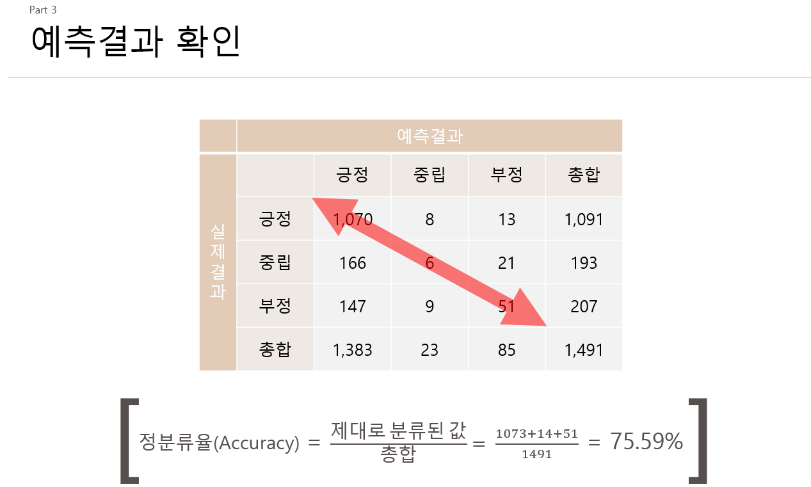
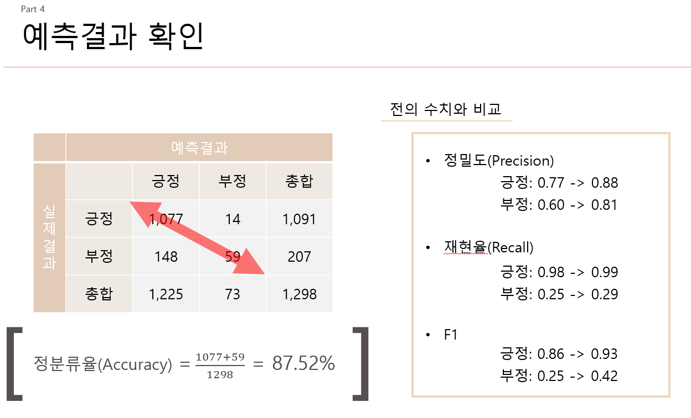

# Naive-Bayes-Classifier_PYTHON

### 나이브베이즈를 이용한 긍부정 분류기
PYTHON을 활용해서 나이브베이즈 분류기 만들기   

스크래핑을 이용해 네이버의 영화 리뷰 데이터를 수집(**총 8,000건의 데이터**)   

OKT의 SimplePos09를 이용해 품사를 태그하고 명사, 동사, 형용사, 특수문자만 추려냄   

긍정, 부정, 중립 분류기에서 정분류율 `75.59%`로 나타남   

### 추가 데이터 예측
다음에서 셀레니움을 이용해 영화 리뷰 데이터를 수집(**총 1,029건의 데이터**)   
긍정과 부정 분류기에서 정분류율 `87.53%`로 나타남
