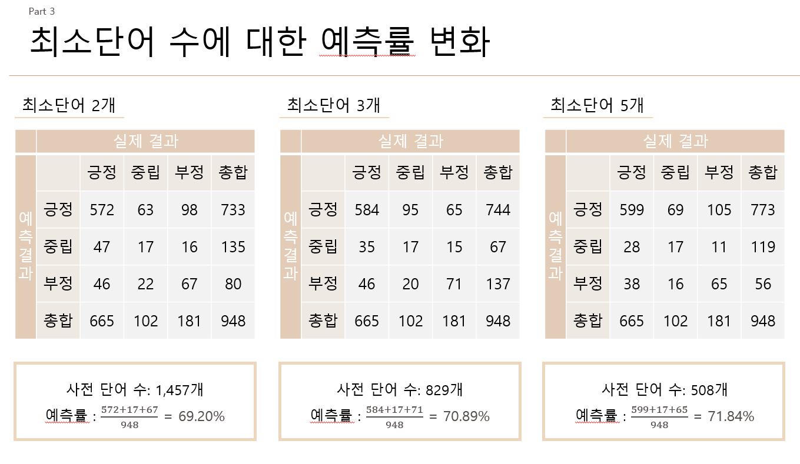

# # Naive-Bayes-Classifier_R
### 나이브베이즈를 이용한 긍부정 분류기
R을 활용해서 나이브베이즈 분류기 만들기   

스크래핑을 이용해 네이버의 영화 리뷰 데이터를 수집(**총 5,000건의 데이터**)    

KONLP의 SimplePos09를 이용해 명사를 추출하는 전처리를 거쳐 나이브 베이즈 이론을 적용   

정분류율 `71.84%`로 나타남   

