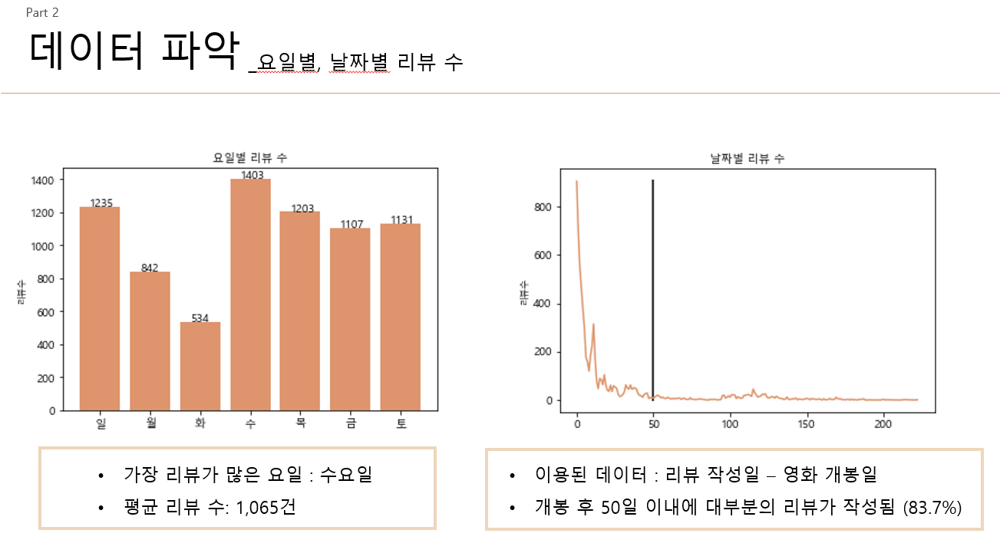
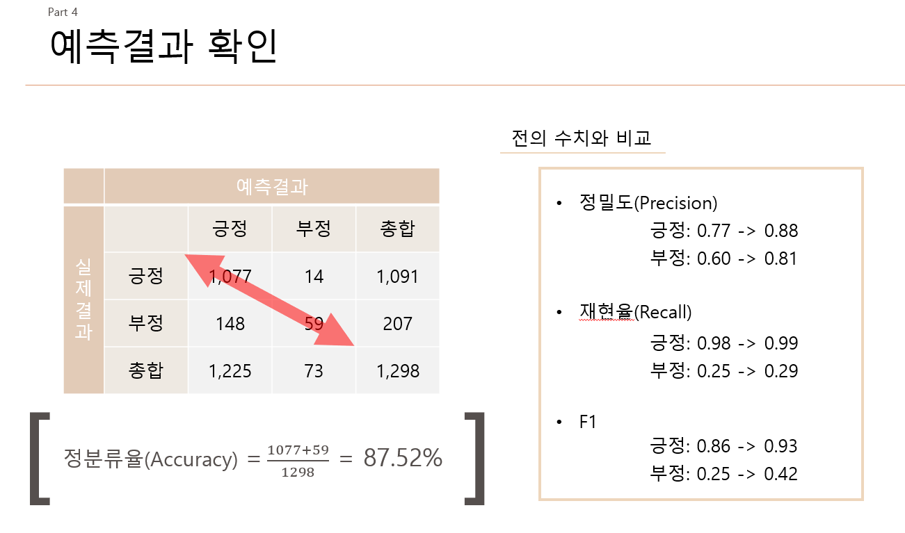

# project2_Navie-Bayes-Classifier

## 영화리뷰를 이용한 나이브베이즈 분석

## 주제
- 영화 `테넷`의 리뷰를 수집하여 리뷰를 긍정과 부정으로 나누는 분류기 만들기
- 긍부정 분류기를 새로운 데이터에 적용해보기

## 목표
영화 `테넷`의 리뷰를 수집하여 리뷰의 점수를 이용해 리뷰를 긍정과 부정으로 나누는 `분류기 만들기`   

## 진행과정
- 분석에 필요한 **데이터 수집**
    - 영화 '테넷'의 영화리뷰 수집 (**총 리뷰수 8,000건**)
    - 수집내용은 평점, 리뷰내용, 작성자, 작성날짜를 수집

- 나이브베이즈이론을 이용한 **분석**
    - 요일별 또는 날짜별 리뷰수와 같은 `데이터 파악`을 실시
          
    - 긍정(8,9,10)), 중립(5,6,7), 부정(1,2,3,4)로 평점을 나누어 실시
    - R을 이용한 분석에서는 `KONLP`를 이용, PYTHON을 이용한 분석에서는 `OKT`를 이용해 리뷰별로 품사를 테그하고 단어를 정제함
    - 나이브베이즈 이론을 이용해 분석 실시

- **결론** 
    - `정밀도, 재현율, F1지수`를 이용해 예측결과를 확인
    - 파이썬을 이용해 분석을 한 경우에는 중립을 삭제한 후, 다음에서 수집한 리뷰데이터로 예측을 실시함
    - 새로운 데이터에 적용했을 때에 정분류율이 87.52%로 나타남
        

## 이용 데이터
- 네이버 영화리뷰 페이지에서 직접 수집하여 사용
- 다음 영화리뷰 페이지에서 직접 수집하여 사용